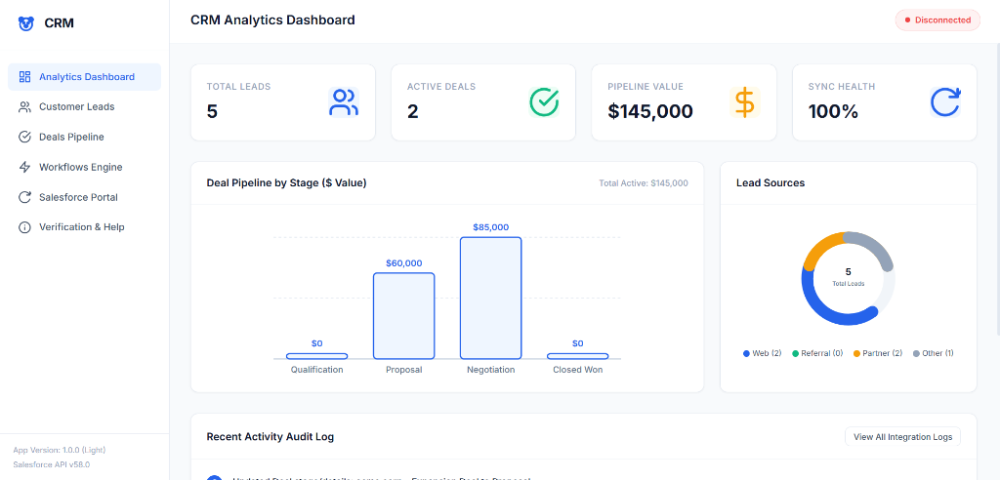
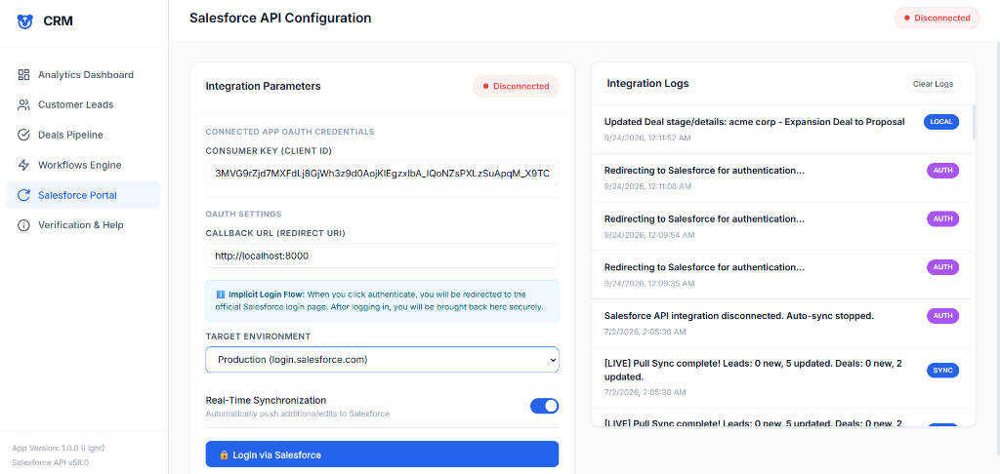
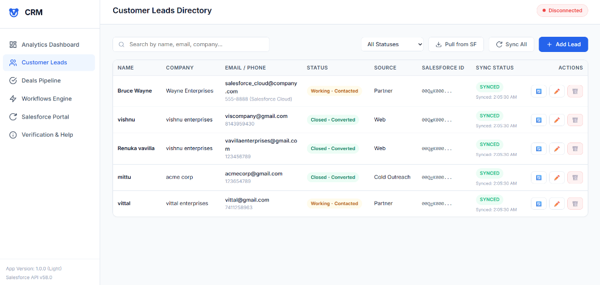

# 🚀 CRM Web Application with Salesforce Integration

A modern, responsive Customer Relationship Management (CRM) web application featuring **Live Salesforce REST API Integration**, bi-directional lead status mapping, real-time background polling, conflict resolution, and automated deal pipeline workflows.

---

## 🌟 Key Features

* **⚡ Live Salesforce Integration**: Directly syncs lead records between your local CRM and Salesforce via standard REST APIs (`/services/data/v58.0/sobjects/Lead`).
* **🔄 Bi-Directional Picklist Status Mapping**: Maps local CRM lead statuses (`Open - Not Contacted`, `Working - Contacted`, `Closed - Converted`, `Closed - Not Converted`) to exact Salesforce standard picklist values.
* **📡 Silent Background Auto-Polling**: Periodically queries Salesforce every 30 seconds for remote updates, keeping your local CRM automatically up to date.
* **⚔️ Side-by-Side Conflict Resolution**: Identifies concurrent updates between local records and Salesforce, allowing users to **Keep Local**, **Keep Salesforce**, or **Merge Custom Fields**.
* **📊 Analytics Dashboard**: Live metrics, revenue pipeline tracking, custom SVG charts, and top lead performance breakdown.
* **🤖 Pipeline Automation Engine**: Automatically converts leads to Deals/Opportunities in the Kanban pipeline upon status transition to `Closed - Converted`.

---

## 📸 Application Screenshots

### 1. Analytics Dashboard


### 2. Salesforce Portal Configuration


### 3. Customer Leads Directory


---

## 🛠️ Technology Stack

* **Frontend**: HTML5, Vanilla JavaScript (ES6 Modules, Publisher-Subscriber Pattern)
* **Styling**: Vanilla CSS3 (Custom Design System, Glassmorphism, Responsive Grid & Flexbox)
* **Backend Integration**: Salesforce REST API v58.0 (OAuth 2.0 Implicit / Password Flow)
* **Server**: Python Built-in HTTP Server (Zero Dependencies)

---

## 📁 Project Architecture

```
CRM-salesforce/
│
├── README.md               # Project documentation & GitHub overview
├── index.html              # Main Single Page Application (SPA) entry point
├── start_server.bat        # 1-Click launcher script for Windows
├── css/
│   └── style.css           # Core design system, tokens, and animations
├── js/
│   ├── app.js              # Application coordinator & routing engine
│   ├── store.js            # Central Pub/Sub state store & Salesforce REST sync logic
│   └── components/
│       ├── dashboard.js    # Analytics charts & performance metrics
│       ├── leads.js        # Lead database table & editor modal
│       ├── deals.js        # Opportunity deals Kanban board
│       ├── salesforce.js   # OAuth connection, CORS log, conflict resolution
│       ├── automation.js   # Automated workflow triggers
│       └── docs.js         # API schema documentation & test console
└── images/                 # High-resolution screenshot assets
    ├── dashboard.png
    ├── salesforce-login.png
    └── customer-leads.png
```

---

## 🚀 How to Run Locally

### **Option 1: Windows 1-Click Launcher**
Double-click [start_server.bat](start_server.bat) in the project directory.

### **Option 2: Terminal / Command Prompt**
1. Navigate to the project directory:
   ```cmd
   cd path/to/CRM-salesforce
   ```
2. Start the local server:
   ```cmd
   python -m http.server 8000
   ```
3. Open your browser and go to:  
   **[http://localhost:8000](http://localhost:8000)**

---

## ⚙️ Salesforce Connected App Setup

To connect this application with your Salesforce developer org:

1. **Enable CORS**:
   * Go to **Salesforce Setup** → **Security** → **CORS**.
   * Add `http://localhost:8000` to the **Allowed Origins**.
2. **Configure Connected App**:
   * Go to **App Manager** → **New Connected App**.
   * Enable **OAuth Settings** and set Callback URL to `http://localhost:8000`.
   * Add OAuth scopes: `Access and manage your data (api)` and `Perform requests on your behalf at any time (refresh_token, offline_access)`.
